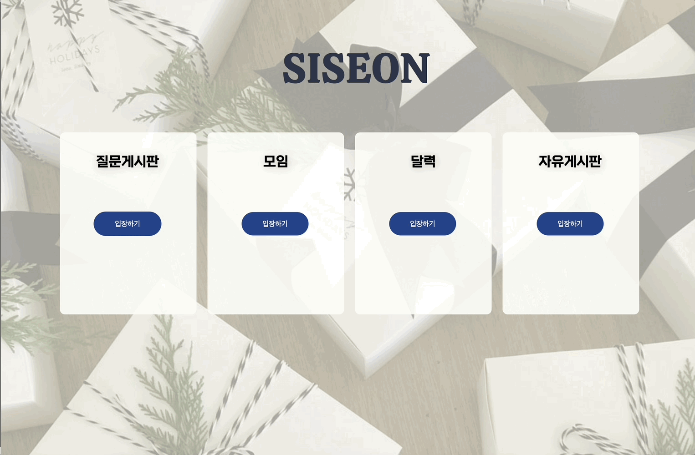
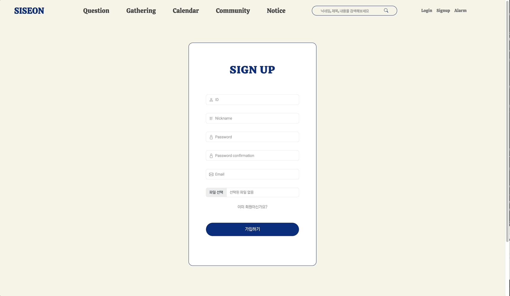
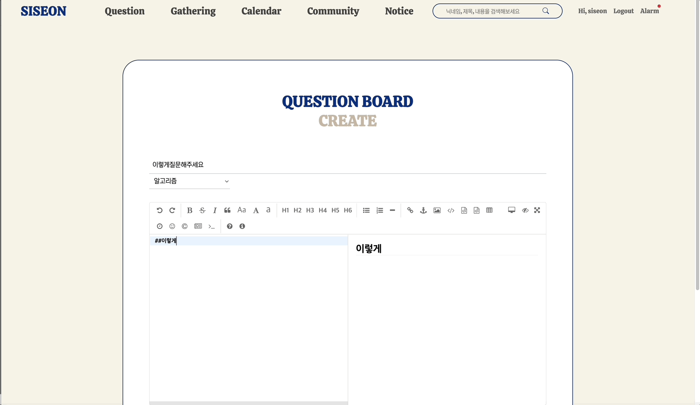
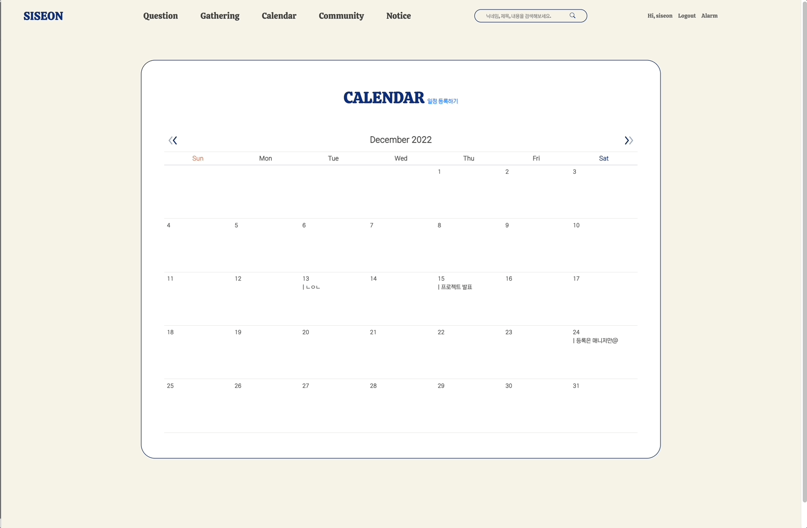
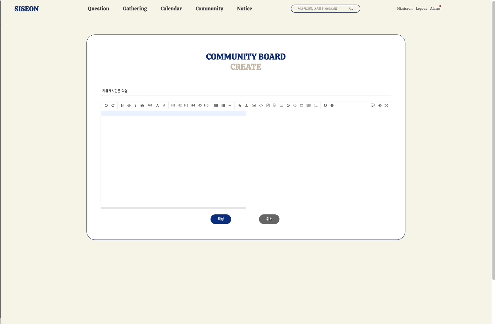
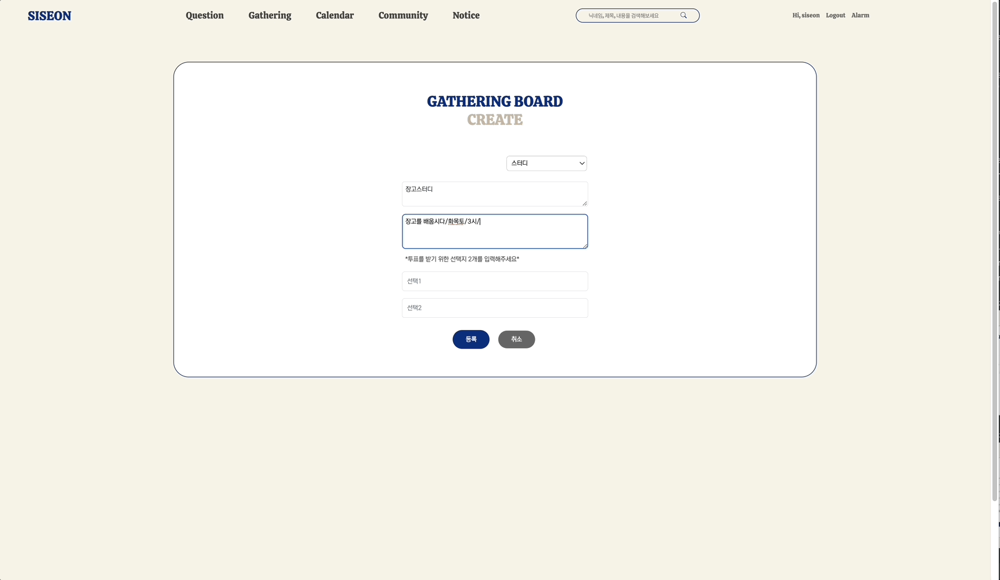
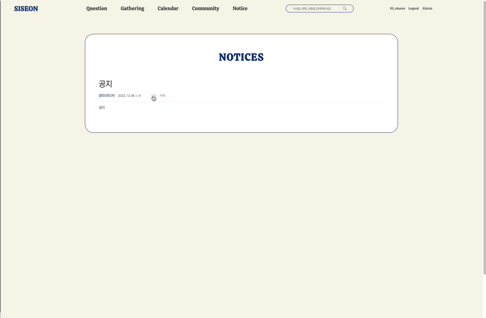

# SISEON
KDT선배(시니어)들의 선물 : 시선(SISEON)

> KDT N기를 위한 사이트

로고이미지

# Contributor

&nbsp;

# 프로젝트 소개

- 🗓**프로젝트 기간**
  - 2022.11.24 (목) ~ 2022.12.14 (월)
- 💻**사용 기술**
  -     

- ⭐**개발 역할 분담**
  - 팀장: 지현식/ 발표자: 이호빈/ PPT 제작자: 김윤지, 배서림, 변규탁
  - **백엔드**: 지현식
  - **프론트**: 이호빈,배서림
  - **풀스택**: 변규탁, 김윤지

&nbsp;
- 프로젝트시 팀원들과의 규칙
1. 커밋 메세지는 앱이름:개발내용  한글로 작성한다.

2. 브랜치 기능이름 앱이름/기능

&nbsp;

# 모델 구조, ERD 작성

## app별 모델

accounts app

**class User:**
 - nickname = models.CharField(max_length=20, unique=True)
 - github_id = models.CharField(max_length=50, blank=True, null=True)
 - profile_url = models.CharField(max_length=50, blank=True, null=True)
 - image = ProcessedImageField(upload_to="media/",blank=True,processors=[ResizeToFill(100, 100)],format="JPEG",options={"quality": 80},)
 - is_social_account = models.BooleanField(default=False)
 - social_id = models.CharField(null=True, blank=True, max_length=100)
 - token = models.CharField(max_length=150, null=True, blank=True)
 - service_name = models.CharField(null=True, max_length=20)
 - social_profile_picture = models.CharField(null=True, blank=True, max_length=150)
 - introduce = models.CharField(max_length=50, blank=True, null=True)
 - notice = models.BooleanField(default=False)
 - followings = models.ManyToManyField("self", symmetrical=False, related_name="followers")

**class Notification:**
 - message = models.CharField(max_length=100)
 - check = models.BooleanField(default=False)
 - user = models.ForeignKey(AUTH_USER_MODEL, on_delete=models.CASCADE)
 - category = models.CharField(max_length=10)
 - nid = models.IntegerField(default=0)

articles app

**class Keyboard:**
 - check = models.BooleanField(default=False)
 - title = models.CharField(max_length=50, verbose_name="Title")
 - category_position = [(None, "질문유형을 선택해주세요."), ("CS", "CS"), ("알고리즘", "알고리즘"), ("진로", "진로"), ("오류", "오류"),("기타", "기타"),]
 - category = models.CharField(max_length=50, choices=category_position, default="질문유형을 선택해주세요.")
 - create_at = models.DateTimeField(auto_now_add=True)
 - updated_at = models.DateTimeField(auto_now=True)
 - content = MDTextField()
 - user = models.ForeignKey(settings.AUTH_USER_MODEL,on_delete=models.CASCADE,)
 - like_users = models.ManyToManyField(settings.AUTH_USER_MODEL, related_name="like_articles")
 - unname = models.BooleanField(default=False)
 - hits = models.PositiveIntegerField(default=0, verbose_name="조회수")
 - q = models.CharField(max_length=50, default="질문")

**class Comment:**
 - content = models.TextField()
 - articles = models.ForeignKey(Articles, on_delete=models.CASCADE, related_name="comment_user")
 - updated_at = models.DateTimeField(auto_now=True)
 - user = models.ForeignKey(settings.AUTH_USER_MODEL, on_delete=models.CASCADE)
 - unname = models.BooleanField(default=False)

**class Photo:**
  - article = models.ForeignKey(Articles, on_delete=models.CASCADE)
  - image = models.ImageField(upload_to="images/", blank=True)

**class Recomment:**
 - class ReComment2(models.Model):
 - comment = models.ForeignKey(Comment, on_delete=models.CASCADE, related_name="article_comment_user")
 - user = models.ForeignKey(settings.AUTH_USER_MODEL, on_delete=models.CASCADE)
 - body = models.CharField("답글", max_length=200)
 - updated_at = models.DateTimeField(auto_now=True)
 - unname = models.BooleanField(default=False)

calendars app

**class Reviews:**
- title = models.CharField(max_length=200)
- description = models.TextField()
- start_time = models.DateTimeField()
- end_time = models.DateTimeField()
- @property
    def get_html_url(self):
        url = reverse('calendars:event_detail', args=(self.id,))
        return f'<a href="{url}"> {self.title} </a>'

Free app

**class Trades:**
 - check = models.BooleanField(default=False)
 - title = models.CharField(max_length=50)
 - create_at = models.DateTimeField(auto_now_add=True)
 - updated_at = models.DateTimeField(auto_now=True)
 - content = MDTextField()
 - user = models.ForeignKey(settings.AUTH_USER_MODEL,on_delete=models.CASCADE,)
 - like_free = models.ManyToManyField(settings.AUTH_USER_MODEL, related_name="like_free")
 - hits = models.PositiveIntegerField(default=0, verbose_name="조회수")
 - q = models.CharField(max_length=5, default="자유")

**class Photo:**
  - free = models.ForeignKey(Free, on_delete=models.CASCADE)
  - image = models.ImageField(upload_to="images/", blank=True)

**class Comment:**
  - content = models.TextField()
  - free = models.ForeignKey(Free, on_delete=models.CASCADE, related_name="free_user")
  - updated_at = models.DateTimeField(auto_now=True)
  - user = models.ForeignKey(settings.AUTH_USER_MODEL, on_delete=models.CASCADE, related_name="free_com_user")
  - unname = models.BooleanField(default=True)
**class ReComment:**
 - comment = models.ForeignKey(Comment, on_delete=models.CASCADE, related_name="free_comment_user")
 - user = models.ForeignKey(settings.AUTH_USER_MODEL, on_delete=models.CASCADE)
 - body = models.CharField("답글", max_length=200)
 - updated_at = models.DateTimeField(auto_now=True)
 - unname = models.BooleanField(default=True)

gathering app

**class Trades:**
user = models.ForeignKey(AUTH_USER_MODEL, on_delete=models.CASCADE)
 - title = models.CharField(max_length=30)
 - content = models.TextField()
 - Moim = "모임"
 - Study = "스터디"
 - CATEGORIES = [(None, "모집유형을 선택해주세요."),(Moim, "모임"),(Study, "스터디"),]
 - category = models.CharField(choices=CATEGORIES, max_length=10, default="모집유형을 선택해주세요.")
 - created_at = models.DateTimeField(auto_now_add=True)
 - updated_at = models.DateTimeField(auto_now=True)
 - like_users = models.ManyToManyField(AUTH_USER_MODEL, related_name="like_gathering")
 - hits = models.PositiveIntegerField(default=0, verbose_name="조회수")
 - q = models.CharField(max_length=50, default="모임")
 - pub_date = models.DateTimeField(default=timezone.now)
 - active = models.BooleanField(default=True)
 
 - def user_can_vote(self, user):
    user_votes = user.vote_set.all()
    qs = user_votes.filter(gathering=self)
    if qs.exists():
      return False
    return True

  @property
- def get_vote_count(self):
      return self.vote_set.count()
- def get_result_dict(self):
    res = []
    dic = []
    cnt = 0
    for choice in self.choice_set.all():
        d = {}
        d["title"] = choice.choice_text
        d["num_votes"] = choice.get_vote_count
        d["pk"] = choice.pk
        if choice.vote_set.all():
            for i in choice.vote_set.all():
                print(cnt)
                d[str(cnt)] = i
                cnt += 1

                    
    if not self.get_vote_count:
        d["percentage"] = 0
    else:
        d["percentage"] = (choice.get_vote_count / self.get_vote_count) * 100

        res.append(d)
    dic.append(res)
    return res

    def get_result_first(self):
        result = []
        for choice in self.choice_set.all():
            d = {}
            d["title"] = choice.choice_text
            d["num_votes"] = choice.get_vote_count

            result.append(d)
        result = sorted(result, key=lambda x: x["num_votes"], reverse=True)
        max = result[0]["num_votes"]

        title = []
        for res in result:
            if res["num_votes"] == max:
                title.append(res["title"])

        return title

    def __str__(self):
        return self.title

**class GatheringsComment:**
 - user = models.ForeignKey(AUTH_USER_MODEL, on_delete=models.CASCADE)
 - gathering = models.ForeignKey(Gatherings, on_delete=models.CASCADE, related_name="gatheringcomments")
 - content = models.TextField()
 - created_at = models.DateTimeField(auto_now_add=True)
 - updated_at = models.DateTimeField(auto_now=True)

**class ReComment:**
 - comment = models.ForeignKey(GatheringsComment,on_delete=models.CASCADE,related_name="gatherings_comment_user",)
 - user = models.ForeignKey(AUTH_USER_MODEL, on_delete=models.CASCADE)
 - body = models.CharField("답글", max_length=200)
 - updated_at = models.DateTimeField(auto_now=True)

**class Choice:**
 - gathering = models.ForeignKey(Gatherings, on_delete=models.CASCADE)
 - choice_text = models.CharField(max_length=255)
 
  @property
  def get_vote_count(self):
      return self.vote_set.count()

  def __str__(self):
      return f"{self.gathering.title[:25]} - {self.choice_text[:25]}"
**class vote:**
  - user = models.ForeignKey(AUTH_USER_MODEL, on_delete=models.CASCADE)
  - gathering = models.ForeignKey(Gatherings, on_delete=models.CASCADE)
  - choice = models.ForeignKey(Choice, on_delete=models.CASCADE)

    def __str__(self):
        return f"{self.user.username}"

notes app

**class notes:**
  - from_user = models.ForeignKey(settings.AUTH_USER_MODEL, on_delete=models.CASCADE, related_name="user_from")
  - to_user = models.ForeignKey(settings.AUTH_USER_MODEL, on_delete=models.CASCADE, related_name="user_to")
  - title = models.CharField(max_length=30)
  - content = models.TextField()
  - created_at = models.DateTimeField(auto_now_add=True)
  - read = models.BooleanField(default=False)
  - important = models.BooleanField(default=False)
  - garbage = models.BooleanField(default=False)

Notices app

**class Notices:**
 - check = models.BooleanField(default=False)
 - title = models.CharField(max_length=50)
 - create_at = models.DateTimeField(auto_now_add=True)
 - updated_at = models.DateTimeField(auto_now=True)
 - content = MDTextField()
 - user = models.ForeignKey(settings.AUTH_USER_MODEL, on_delete=models.CASCADE, related_name="notices_user")
 - image = models.ImageField(upload_to="images/", blank=True)
 - hits = models.PositiveIntegerField(default=0, verbose_name="조회수")

&nbsp;&nbsp;

# 🧾기능 소개

## main
- 메인페이지

## Accounts/all

- 소셜로그인
- 쪽지보내기(모달)
- 비동기 쪽지 삭제
- 내가 쓴 질문게시글, 자유게시글, 모임게시글 각각 보여주기(상대방에게 익명 비공개)
- 내가 쓴 질문댓글, 자유댓글, 모임댓글 각각 보여주기(상대방에게 익명 비공개)
- 내가 보낸 쪽지, 받은 쪽지 보여주기(제 3자에게 쪽지 비공개)
- 비동기 팔로우 기능
- 회원 탈퇴

![letteralram])(./screen/letteralram.gif)
&nbsp;

## Articles/all

- 에디터 기능
- 비동기 댓글 생성(익명 선택) 및 필터링
- 비동기 대댓글 생성(익명 선택) 및 필터링
- 비동기 게시글 좋아요
- 게시글 작성(익명 선택)
- 검색기능
- 페이지네이션

&nbsp;

## Calendars/detail 

- 일정 공유 기능
- 관리자에게 문의시 일정 추가가능

&nbsp;

## Free/all

- 에디터 기능
- 비동기 익명 댓글 생성 및 내용 필터링
- 비동기 익명 대댓글 생성 및 내용 필터링
- 비동기 게시글 좋아요
- 익명 게시글 작성
- 검색기능
- 페이지네이션

&nbsp;

## Gathering/all

- 버튼으로 스터디/모임 구분
- 비동기 댓글 생성 및 필터링
- 비동기 대댓글 생성 및 필터링
- 비동기 게시글 좋아요
- 게시글 작성
- 투표 기능
- 페이지네이션
- 검색기능
- 투표자 확인(모달창)

&nbsp;

## Notices/all

- 공지사항
  

&nbsp;

## Search/all

- 모든 게시판, 내용 으로 검색기능

&nbsp;

## 후기작성
- 지현식 : 맡은 바 역할을 충실하게 실행하지 못하여서 아쉬움이 남는 프로젝트
- 김윤지 : 반복적인 오류로 많이 지쳤을텐데도 끝까지 열심히 해주셔서 감사함을 전하고 많은 걸을 배울 수 있었던 시간 이였습니다.
- 이호빈 : 좋은 팀원들이랑 3주 동안 프로젝트를 잘 마무리 할 수 있어서 좋았습니다.
- 변규탁 : 디버깅은 해도해도 새롭다 모두 끝까지 잘 해주셔서 감사합니다~!
- 배서림 : 많은 걸 배울 수 있는 시간이었습니다. 과정이 끝나도 다들 화이팅!!